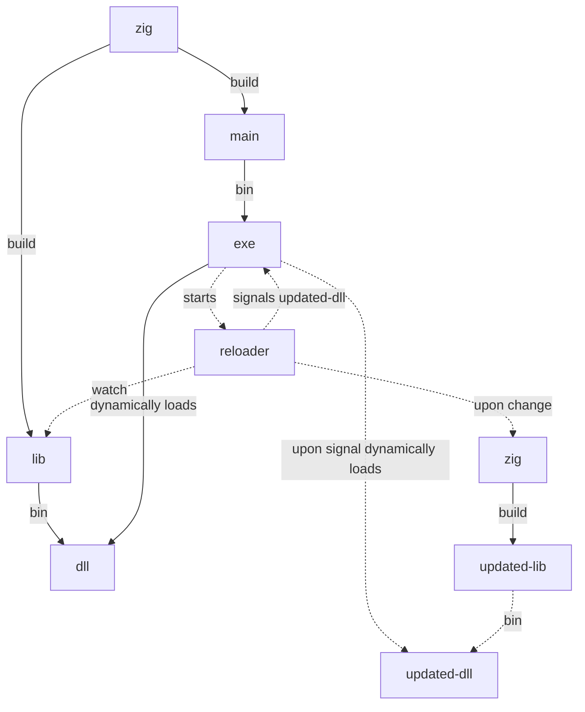

## live editing

This sample application watches for source code changes and loads it directly into a running game. This allows for extremely short edit to executing cycle.

This sample requires **Windows**.

To build and run on Windows:

```
zig build live_editing-run
```

Then change one of the following files:

1. `samples/live_editing/src/entry.zig`
2. `samples/live_editing/src/live_editing.hlsl`

https://github.com/Pyrolistical/zig-gamedev/assets/463642/96d637c9-b6b7-4fe2-bcdc-461d48eab1d8

### How it works


The editable files are built as a dynamic library, which the main exe depends on. When the main starts, it starts the reloader which is a thread that watches for file changes.  When an editable file is change, the reloader rebuilds the library and signals to the main thread the library has been updated. Finally, the main thread reloads the dynamic library.
